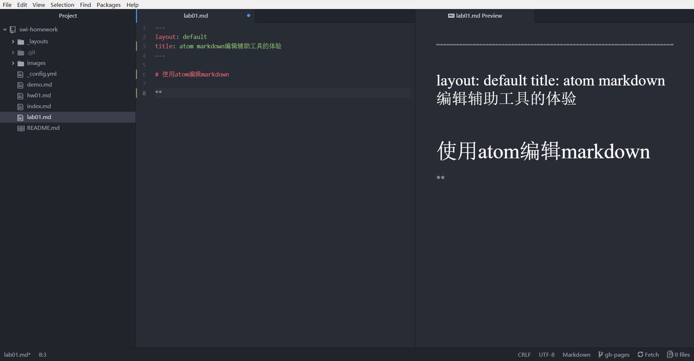
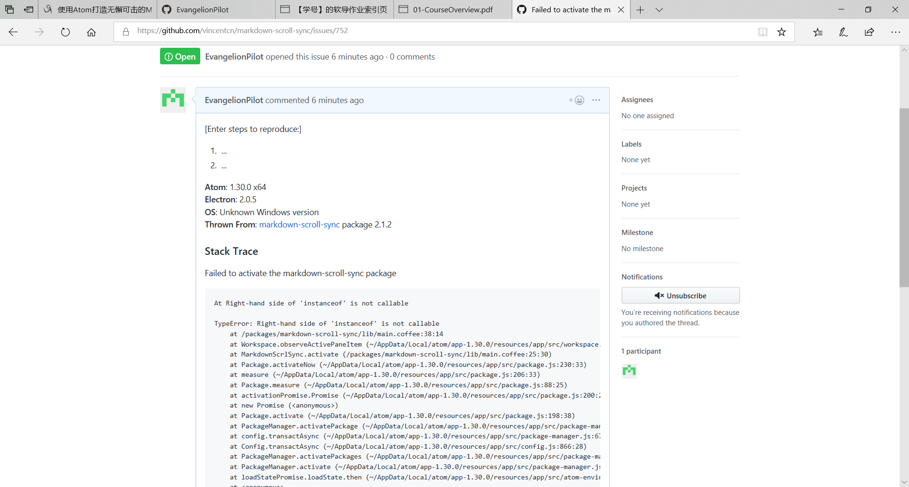
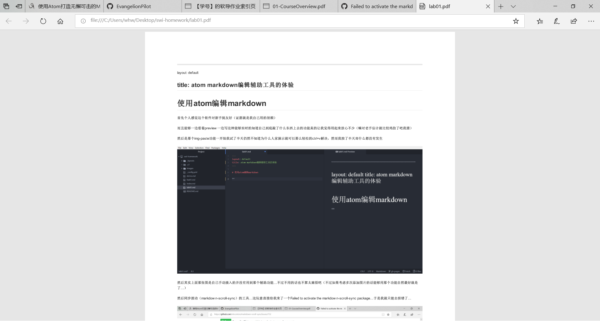

# 一位新手使用atom编辑markdown的经历

首先个人感觉这个软件对新手挺友好（证据就是我自己用的很顺）

而且能够一边看着preview一边写这种能够实时的知道自己到底敲了什么东西上去的功能真的让我觉得用起来放心不少（嘛对老手估计就比较鸡肋了吧我猜）

然后是那个img-paste功能一开始我试了半天仍然不知道为什么人家演示就可以那么轻松的ctrl+v解决，然而我按了半天却什么都没有发生

然后其实上面那张图是自己手动插入的并没有用到那个辅助功能...不过不用的话也不算太麻烦吧（不过如果考虑多次添加图片的话能够用那个功能自然最好就是了...）

然后同步滚动（markdown-scroll-sync）的工具...这玩意直接给我来了一个Failed to activate the markdown-scroll-sync package...于是我就只能去报错了...

接下来我尝试了markdown-themeable-pdf这个工具，然后果然出现了那位博主说的phantomjs无法安装成功的错误，然后我发现貌似还有一个下载量更高的markdown-pdf貌似也可以实现相同的功能，于是就试了一下那个

[lab01](lab01.pdf)

超好用而且不需要再去额外安装文件，能够一键在源目录生成真的超赞

不过很尴尬的就是我不知道怎么把那个pdf链接上来...用贴图片的方法的话在预览这里就是一行字，反而不加!还可以当成个链接（也不知道能不能用...）就先这样吧...

其余的功能我就没有再去一个一个试了，总之作为一个非软工专业的人第一次接触到这一类好像很专业的玩意的时候还是挺兴奋的肝到了两点...真的可以说是意外的觉得还挺好玩

好了第一次的博客就写到这里咯
