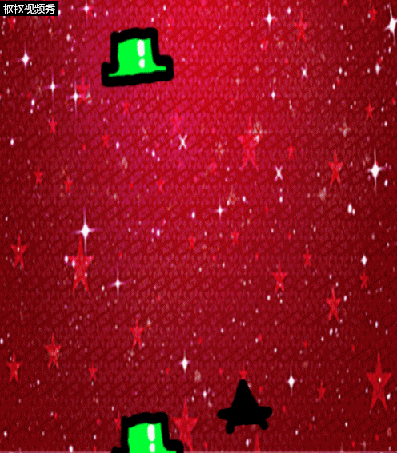

**My first experience in creating a game by Construct2**

 As a green hand in computer programming, I actually have met some problems in this homework.

First, I don't know how to make the size of the picture fit in the size of the layout. And every time I wanted to make a picture fill in the whole layout, I found the picture has been repeated. And after I tried for several times to adapt the parameter I could find, I finally noticed the size of the picture could be modified in the windows of editing the picture, where has a button named "resized".

The second problem I met is cropping the image. I have read in a guide, indicating that the empty transparent space could be cropped by pressing the Crop button on the image editor toolbar. But when I took it into practice to modified my pitcure downloaded from internet, I found it useless as it didn't do anything to my picture. I really don't know what's wrong with it, and it still remain a problem until now.

Then, when I was adding some behaviors to an object, the result of the movement didn't my assumption. To be detailed, as I am designing a game about shooting, the direction of the bullet can't match my willing. It continously flying not in the direction that the monster comes from. And eventually I found the error was in the angel of what spawns the bullet. 

After overcoming the main problems stated above as well as many small problems I don't mention, I managed to creat what can be called a game. Although it has a very poor function, it's actually the first game I made.

