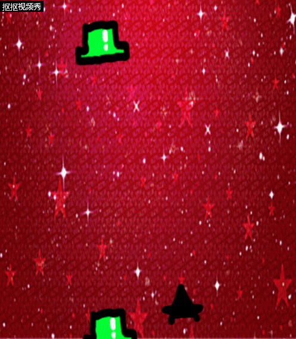

1. 游戏的策划
* 创作动机：制作一款具有搞笑元素的减压小游戏
* 目标市场：具有一定生活压力的年轻人
* 游戏故事：开飞机用滑稽打绿帽
* 玩法：上下左右四个键操纵飞机移动，空格发射滑稽打绿帽，绿帽会不断从屏幕顶端生产并落下，飞机被绿帽砸中游戏结束
* 道具与规则：
  * 飞机：玩家操控的武器，有较高的移动速度并且可以发射滑稽作为武器，但是对绿帽很脆弱一砸就死
  * 绿帽：玩家需要对抗的对象，有较高生命值（三个滑稽才能打掉一个绿帽），并且会不断地从天上掉落
  * 滑稽：飞机的子弹，具有很高的搞笑效果
* 附加说明：

  本游戏由于不限制绿帽在不被玩家摧毁的情况下飞离屏幕底部所以允许玩家采用躲避的方法进行游戏

  之后还会附加在游戏结束时显示躲避以及击毁的绿帽数的功能增加游戏的趣味性

2. 游戏设计
* Object:飞机
  
  Attribute:图片，位置

  Collaborator:精灵

  Events&Actions:自由移动，与绿帽碰撞自毁，空格发射滑稽，不能飞出游戏界面

* Object:绿帽
  
  Attribute:图片，位置，生命值

  Collaborator:精灵

  Events&Actions:每秒在顶部随机位置生成，自上向下平动，累计与三个滑稽碰撞后自毁，与飞机碰撞后自毁，飞出界面后自毁

* Object:滑稽
  
  Attribute:图片，位置

  Collaborator:精灵

  Events&Actions:空格键在飞机头部生成并往上平动，与绿帽碰撞或飞出屏幕自毁

3. 
